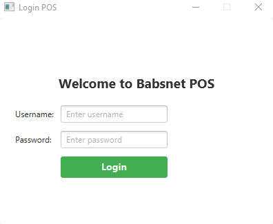
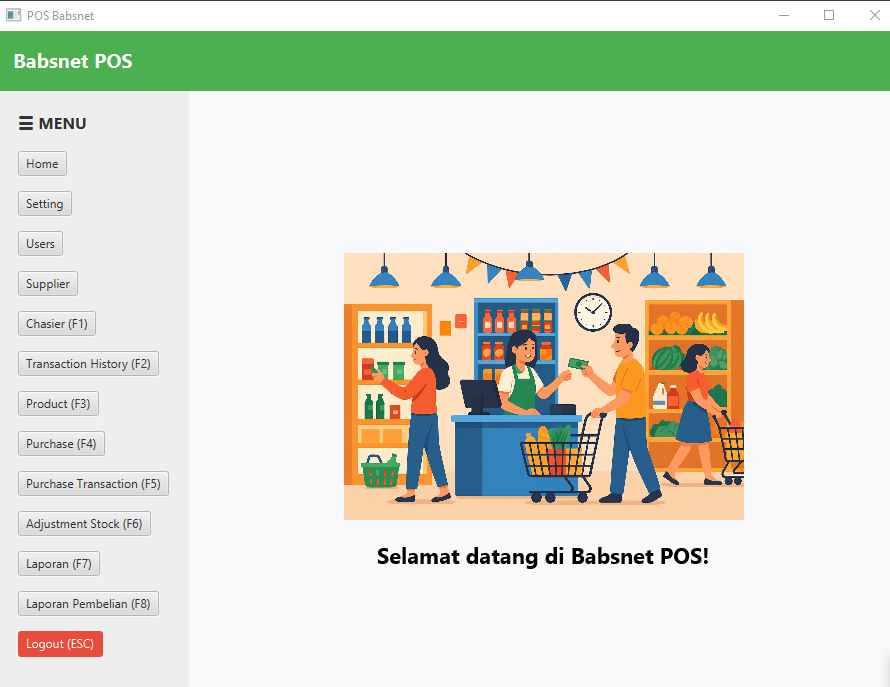

# Babsnet POS


Babsnet POS adalah aplikasi **Point of Sale (POS) desktop** modern berbasis JavaFX yang dirancang untuk kebutuhan kasir, inventori, dan manajemen toko kecil hingga menengah.  
Aplikasi ini mendukung multi-user, hak akses admin, tampilan modern, dan proses transaksi cepat.

---

## ✨ **Fitur Utama**

- **Login Multi-user** (Admin/Kasir)
- **Manajemen Produk & Stok**
- **Transaksi Penjualan & Pembelian**
- **Laporan Penjualan, Laporan Pembelian**
- **Manajemen Supplier & User**
- **Adjust Stok (Penyesuaian)**
- **History Transaksi & Detail Transaksi**
- **Hotkey Navigasi (F1 - F12, ESC)**
- **Tampilan dashboard dinamis**
- **Dukungan Logout aman (clear session)**
- **Session login otomatis (auto login sampai logout)**

---

## 📸 **Tangkapan Layar**

| Login Screen                    | Dashboard / Home              |
|---------------------------------|-------------------------------|
|  |  |

---

## 🚀 **Teknologi & Tools**

- **Java 17+**
- **JavaFX** (UI Desktop)
- **Gradle** (Build System)
- **SQLite/MariaDB** (Database)
- **FXML** (UI Layout)
- **Logback** (Logging)
- **Maven/Gradle Wrapper** (Build Anywhere)

---

## ⚡ **Cara Build & Run**

### 1. **Clone Repository**
```bash
git clone https://github.com/okomtayiw/babsnet-app-pos.git
cd babsnet-app-pos
